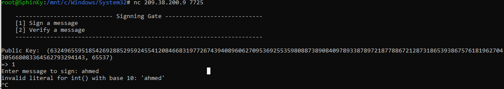
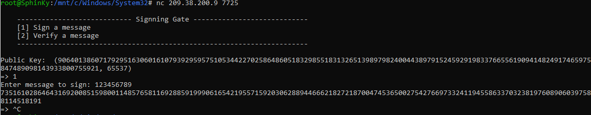
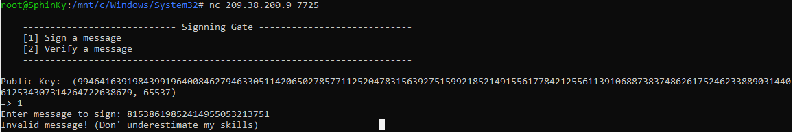

# ICMTC_CTF_2023_crypto_writeup

# Easy Encryption


You were given this code as the implementation of the cryptosystem, and you need to retrieve the flag.
```
from gmpy2 import next_prime
from Crypto.Util.number import getPrime,bytes_to_long
from random import randint
import os
from flask import Flask


app = Flask(__name__)
@app.route('/start/')
def decrypt():
    flag = os.environ.get("CTF_FLAG", "EGCTF{FAKE_FLAAAAAAAAAAAAG}")
    m1 = bytes_to_long(flag[:len(flag)//2])
    m2 = bytes_to_long(flag[len(flag)//2:])
    e = 0x10001
    z = getPrime(512)
    p1 = getPrime(512)
    q1 = next_prime(p1)
    n1 = p1*q1
    p2 = next_prime(q1)
    q2 = next_prime(p2)
    n2 = p2*q2
    n3 = n1 * n2
    n4 = q1 * getPrime(1024)
    c1 = (z * pow(m1,e,n3)) % n3 
    c2 = (m1*randint(1000,30000) * pow(m2,e,n4)) % n4
    
    return {'n1':int(n3) , 'n2':int(n4), 'c1':int(c1), 'c2':int(c2), 'z':int(z), 'e':int(e)}


@app.route('/')
def home():
	return "Hi!"

if __name__ == "__main__":
    app.run()


```
After examining the code, you find that it divides the flag into two halves and decrypts them individually, it generates a random prime number `z` and a random prime number `p1`. It then calculates the next three prime numbers that come after `p1` using the `nextprime()` function.

Both `n3` and `n4` are too large to be factored conventionally, so you need to find another way to obtain their factors. By exploiting the fact that the four prime numbers are consecutive, you can calculate the fourth root of `n3` and search for numbers around that range. 

Subtracting 1001 from the root to search for the first prime number was a random choice; it could be larger or smaller, its okey as long as you find the correct set of primes.

```
import gmpy2
from gmpy2 import next_prime
from Crypto.Util.number import long_to_bytes

data = {
    "c1":10494594817606388800598630421088412077610178208917183436758651534443011137318789259189004788991271754057292333843945515191540062933587788672742804584638498898913284652484566662140428023407286472842128042100144208648394206461911365467078021165179810183889271367721595716855552837375766917665388836410912311712182150222208508486685008334679413220896887706279964062196343353306735268390749246508335121073213569793024804194361119173910908193464768408669484423648012121235765973120330170376622423968007387546246673497457996252808277571286147301050915881876660734152703762169352227978528242648710971775624208286058635509147,
    "c2":1181089300385290038545450447653745616471546798072348810113868737506573530574748922191487934967587521109359474137439006842012148096548168832800456377744128518450788050538422027821242205850332534949354837998363846875214586050674034313712611334734539263722441034570554686448843943253870081415956805565737052454320232260123151118337464778676461438493306524534037864470992421936197833929653000024517225983229332774170961990555546764993428751103180903431229037129567548,
    "e":65537,
    "n1":29309988347602774816800569960951173289735438884435108057907819186832327764986537475917324020760071780049670760446553036757920240748591649076945603256057970677378012423240123569916696335000528192837235968888534001594035496332560174486094130923211280672505360361237432632690628798054571326797138811617601465489203650427921639931323609070124652786424612356227518421391229322563954873516883927574244220764316577326729792521550524437719316435734146060533573109765413341706576084621339352061789995651218600634109292551792801402654739773699312547279758016365788104381527516497399606049627167394802927560463963212254272339689,
    "n2":2163812862820033743029921693913187800260390831595846318713815056227057151601570042024345259428454619921358342059421249173351886022098522884333013540135621668785575757316418787623338766282296340728353430030315156233336751592376237995749670812509024406659678546860734884082082864813301803854965742569393111106919099671143939532209316683165293701691228736916813323531153934180342622766304158579902731870160970380084960674724581738219630223436608916234887703172998923,
    "z":12267420403787048837369033471595082547678696902798842511574363053350980703361421681327489428983500469440546893961339114658011969353284152437011531768069677
}


#cracking the N to get the 4 primes, you know that they are 4 consecutive prime numbers so search in the range of the N**(1/4) for the first prime
temp = int(data["n1"])

root , is_true_root=gmpy2.iroot(temp, 4)
root-=1001
for i in range(2000):
    temp= root
    product = 1
    for d in range(4):
        temp = next_prime(temp)
        product*=temp
    if product==int(data["n1"]):
        tempRoot = root
        break
    root+=1

#storing primes in list
primes = []
for d in range(4):
    tempRoot = next_prime(tempRoot)
    primes.append(int(tempRoot))
```

Now, after obtaining the factors, it is easy to calculate the private keys, but that is not the problem. You can observe that after encrypting `m1`, it was multiplied by `z` and all of that was done modulo `n3`. You only need the value of `pow(m1, e, n3)` to decrypt the first half of the message.

Let `invZ = pow(z, -1, n)`. You can assume that `(y^x) mod n = (z * invZ * y^x) mod n`. By applying this, you can retrieve the value of the encrypted `m1`.

```
#c1 = (z * pow(m1,e,n3)) % n3 
phi1 = 1
for x in primes:                #calculating Euler's totient
    phi1*=(x-1)
d1 = pow(data["e"],-1,phi1)     #calcuting the dec key
invZ = pow((data["z"]),-1,data['n1'])
powM1 = (data["c1"]*invZ)%data["n1"]
M1 = pow(powM1,d1,data["n1"])
print(long_to_bytes(M1).decode("UTF-8"),end='') #printing the first half of the flag
```

Now that you have the first half of the flag, you need to apply the same technique to obtain the second half. However, since it is a random number within the range (1000, 30000), you will need to use brute force to find the correct number used.

```
#c2 = (m1*randint(1000,30000) * pow(m2,e,n4)) % n4

randPrime = data["n2"]//primes[1]       #getting the other factor of n4
phi2 = (primes[1]-1)*(randPrime-1)      #Euler's totient for second dec key

d2 = pow(data["e"],-1,phi2)
invM1 = pow(M1,-1,data["n2"])
for x in range(1000,30001):
    invx = pow(x,-1,data["n2"])
    temp2 = (invx * invM1 * data["c2"])%data["n2"]
    m2 = pow(temp2,d2,data["n2"])
    try:
        temp = long_to_bytes(m2).decode('UTF-8')
        print(temp)
        break
    except UnicodeDecodeError:
        pass  # Skip printing if decoding fails

```
using `try` as there is a high chance that only the correct flag that has bytes that could be decoded so it get printed.

flag: `EGCERT{16500bc003f74b4ba6ef9640dfe637596fe3466e5_f7006340}`


# Simple Cipher

You were given this code as the implementation of the cryptosystem, and you need to retrieve the flag.
```
import os 

FLAG = open("flag.txt", "rb").read()        
KEY = os.urandom(FLAG.index(b"{")+1)        
print(len(KEY))
def xor(plain):
    enc = b""
    for i, c in enumerate(plain):
        enc += int.to_bytes(c ^ KEY[i % len(KEY)])
    return enc.hex()    

print(xor(FLAG))
```

You notice that the key creation step generates a key of length 7, considering the flag format as `EGCERT{FAKKKKKKKKKKE}`. Since only XOR was used, you can retrieve the key by XORing the given output with the known part of the flag. After retrieving the key, you can process the remaining output to obtain the original message.

```
out = "61bade96f3f7f36d90c29b92d1bb7b8aa9ba9692e61da2c9e3fefbb876dce0"
out = bytes.fromhex(out)    #convert hex to bytes

temp = b'EGCERT{'           #known part of the flag 
key = b''

for i in range(7):                      #XORing the known part of the flag and output to retrieve the key
    key+=(int.to_bytes(out[i]^temp[i]))
#print(key)
fin = b''
for i, c in enumerate(out):
        fin += int.to_bytes(c ^ key[i % len(key)])
print(fin)
```

flag: `EGCERT{Im_H3r3_w4i71n9_T0_X0R!}`


# Sign Gate

In this challenge, you are required to send the signature of 'Crypt0N19h7' to a server in order to retrieve the flag. First, try connecting to the server using `nc 209.38.200.9 7725` and observe what happens.

You will notice that the server provides two options: signing or verifying a message, and it also gives you a public key. I tried testing it by using 'Ahmed' as a message, but this is the result I obtained.





But it's okay; you can convert your message to an integer using `bytes_to_long()`. I attempted to reconnect to the server and noticed that I received a new public key. Therefore, a new key pair is generated each time a connection is made. To understand what exactly happens at the server, I tried signing the number '123456789' and received back `c`, which is equal to `pow(m, d, n)`. I verified this by calculating `m` from `pow(c, e, n)`. So, what happens is that the server sends you a public key, and the message is encrypted using the private key associated with that public key. The server then sends back the resulting cipher to you.





Okay, since we need to submit the signature of 'Crypt0N19h7', all we need to do is sign the int() value of this message and then verify it. However, the server was prepared for this action. Also you need to notice that after a small amount of time the connection with the server is closed.





You can bypass the server filter by utilizing the fact that `(d)^e mod n == (d+n)^e` mod n and adding the value you obtained from the server to the message. This allows you to still retrieve the correct signature. Since the connection was closed quickly, it is challenging to sign and verify the message manually. Therefore, you need to automate the process.


```
from Crypto.Util.number import bytes_to_long, long_to_bytes
import socket
import time

#m1 = Crypt0N19h7
message = bytes_to_long(b'Crypt0N19h7')

# Connect to the specified IP address and port
sock = socket.socket(socket.AF_INET, socket.SOCK_STREAM)
sock.connect(('209.38.200.9', 7725))

# Receive the initial output from the server
output = sock.recv(4096).decode()

# Find the starting index of the public key tuple and extract it
start_index = output.find('Public Key:') + len('Public Key:')
key_str = output[start_index:].strip()
key_str = key_str[:-2]
key = eval(key_str)  # Evaluate the string representation of the tuple to get the actual tuple
print(key)


# Send value 1 to the server after a delay of 0.5 seconds
#I used a delay because I was concerned that a message could be sent before receiving a response from the server. Using a barrier is a safer approach.
time.sleep(0.5)
sock.send('1\n'.encode())


# Receive the new input from the server
sig_output = sock.recv(4096).decode()
print(sig_output)

# Send the value of key[0]+message to the server after a delay of 0.5 seconds
time.sleep(0.5)
sock.send((str(key[0]+message) + '\n').encode())

######################################################################
sig_output = sock.recv(4096).decode()
print(sig_output)
# Extract the integer value from the received sig output
sig = int(''.join(filter(str.isdigit, sig_output)))

# Send value 2 to the server after a delay of 0.5 seconds
time.sleep(0.5)
sock.send('2\n'.encode())


sig_output = sock.recv(4096).decode()
print(sig_output)

# Sending the signature
time.sleep(0.5)
sock.send((str(sig) + '\n').encode())


sig_output = sock.recv(4096).decode()
print("Final  = ",sig_output)
sock.close()
```


